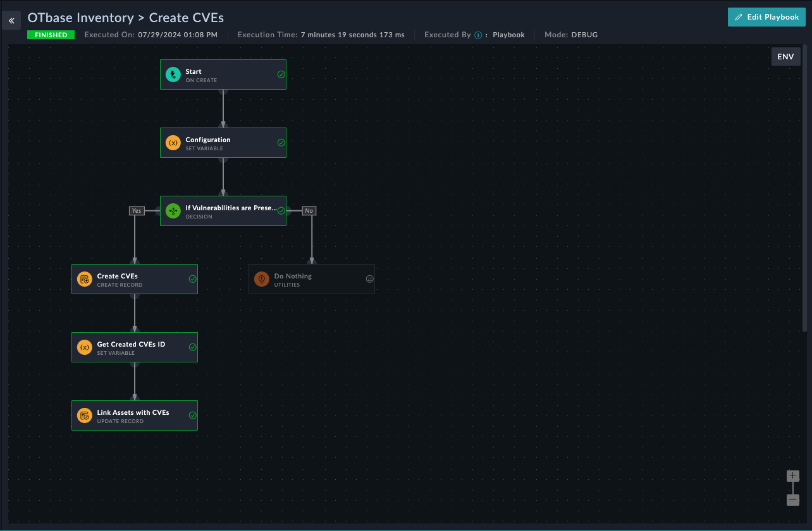
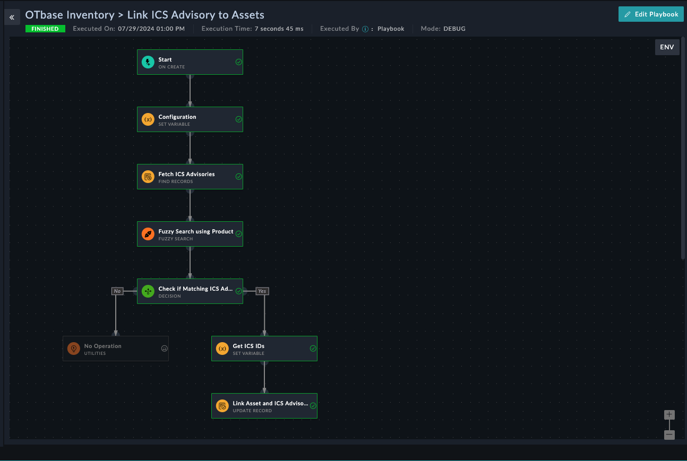

[Home](../README.md) |
| ------------------ |

# Usage

**OTbase Inventory** Solution Packs helps in creation and management of vulnerabilities found in OTbase Inventory assets, by creating and linking CVEs and ICS Advisory to the respective Assets.

On creation of a new asset:

- The **OTbase Inventory > Create CVEs** playbook automatically triggers to create and link vulnerabilities (CVEs) associated with that asset.

    

- The **OTbase Inventory > Link ICS Advisory to Assets** playbook automatically triggers to link ICS Advisory based on *Product* and *Vendor* name associated with that asset.

    

# Next Steps

| [Installation](./setup.md#installation) | [Configuration](./setup.md#configuration) | [Contents](./contents.md) |
| --------------------------------------- | ----------------------------------------- | ------------------------- |
